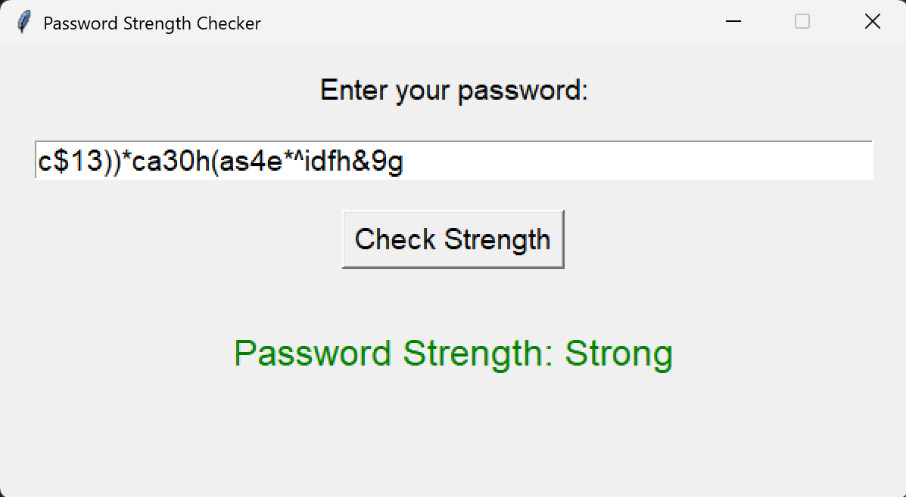
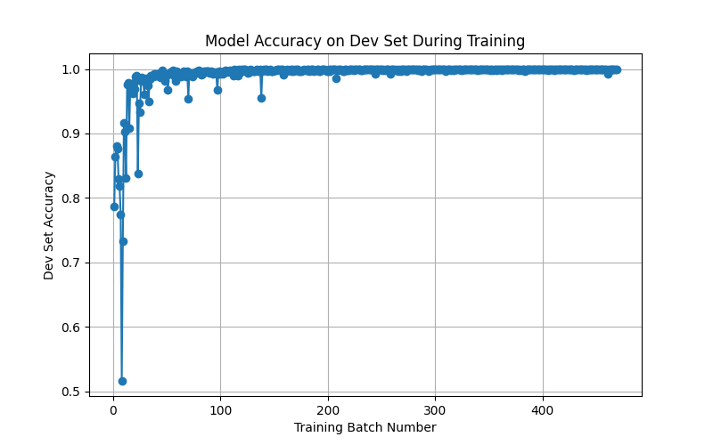

# **Password Strength Checker**
Password Strength Checker App that allows users to check the strength of their password.



## **1. Dataset**  
The dataset is taken from **[Kaggle - Password Strength Classifier Dataset](https://www.kaggle.com/datasets/bhavikbb/password-strength-classifier-dataset)**.  

- The dataset contains 669,643 passwords, each labeled as:
  - `0` → Weak  
  - `1` → Medium  
  - `2` → Strong  
- **Data Splitting:**  
  - **Train Set:** 70%  
  - **Dev Set (Validation):** 20%  
  - **Test Set:** 10%  

---

## **2. Feature Extraction**  
We extract both statistical and character-based features to analyze password strength:

- **Password Length:** Total number of characters.  
- **Contains Digit:** Whether the password contains at least one digit.  
- **Contains Special Character:** Checks for special symbols (`!@#$%^&*`).  
- **Contains Uppercase:** Identifies if the password has capital letters.  
- **Word Match:** Matches passwords against an English word dictionary.  
- **Levenshtein Distance:** Measures similarity to common weak passwords.  
- **Character Entropy:** Measures randomness of characters.  
- **Keyboard Pattern Detection:** Identifies common keyboard sequences (e.g., `qwerty`, `1234`).  
- **Repeated Characters:** Checks if any character repeats more than twice.  
- **Vowel-to-Consonant Ratio:** Computes the proportion of vowels to consonants.  

We also apply TF-IDF vectorization to capture character-level patterns.

---

## **3. Training Loop & SGD Use**  
- We use Stochastic Gradient Descent (SGD) for incremental learning and also because it is faster to train as compared to other alogorithms like Random Forest Classifier.

---

## **4. Results**  

### **Accuracy Plot**  
The accuracy of the model on the development set over training batches is shown below:  

  

### **Final Test Accuracy & Classification Report**
```sh
Final Test Accuracy: 0.9995
Classification Report:
              precision    recall  f1-score   support

           0       1.00      1.00      1.00      9140
           1       1.00      1.00      1.00     49428
           2       1.00      1.00      1.00      8396

    accuracy                           1.00     66964
   macro avg       1.00      1.00      1.00     66964
weighted avg       1.00      1.00      1.00     66964
```
---

## **5. Limitations**  
This tool relies on password length and common patterns, which may not always reflect true security strength. It is a basic machine learning model and does not match the robustness of enterprise-level security checkers. The dataset may not cover all characteristics of weak passwords.  

## **6. Ethical Considerations & Responsible Use**  
This tool should be used responsibly and not be modified for malicious purposes or to mislead users about password security.  


## **7. License**  
This project is licensed under the **MIT License**. 

## **8. How to Run**  
Please clone the repositary and run the app using the following command from the base directory of the repsitory:  

```sh
python User_Interface/ui.py
```
- Then type in your desired password and click check strength to see the strength of your password displayed as either: Strong, Medium or Weak.